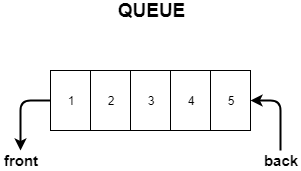

## I. Queue
### Introduction
Queues are a great way to keep order. It's the first in, first out principle. We use queues when we are in checkout lines, a waitlist, etc. They are in our everyday life. Because it's ordered, this saves us time trying to find whatever should be next, but is buried somewhere else in our list. Queues are essentially lists with a specific order of who goes out first, and where we add new items to our list. 

### Structure
Queues look like lists. We can initialize a queue like we would a list/queue with this code.

```name_of_queue = []```

How queues work is that they remove one at the top (left side) of the list, and add at the back (right side) as directed. Just like how any normal checkout line at the grocery store would work.



### Inserting
To insert in a queue, we are simply appending to the back of the list (that's how queues work, remember?). We can do this with this code ```name_of_queue.append(item)``` it's a very simple and straightforward way to work with this array.

### Removing
Removing an item from a queue is also really simple. We can treat it just like we would any list. By using ```name_of_queue.pop(0)``` this will take off the first item of our queue. We can remove items from our list or queue by using indexing. Remember indexes in queues and lists start on 0. That's why ```name_of_queue.pop(0)``` works. "0" is the first item in our queue. We can then save that item we "popped" into a variable and then either print it or whatever else we need to do with it like so

```item = name_of_queue.pop(0)  ```
```print(item)```

In life, queues don't always work perfectly. Sometimes people get tired of waiting, other commitments, etc. and need to leave the line. That would be exiting a queue. By using indexing slicing, we can access any part of our queue. If we need to remove an item we can use the pop function but index of a "0" we can use any other index number to access the value associated with that index. 

```name_of_queue.pop(5)```
```del name_of_queue[0]```

We can also use the delete function shown above which will remove that value. Using "pop" and "del" will remove that value. Just how all python lists work when using these functions, all values will slide over to the left by one changing their index values and effectively shortening the list by one.

### Finding the Length of a List
In some cases it might important for us to know how many items we have in our queue. We can get that number by running the code below.

```python
length = len(name_of_queue)
```

### Looping through Lists (Arrays)
We can loop through our list/queues to access the values fairly easy by using a for or range loop like this.

```python
for item in name_of_queue:
        print(item)
```
### Big O Notation
Big O Notation is looking at the worst case scenario that allows us to evaluate how effecient our algorthim is.

Operation       | Efficency
----------------|-----------
Looping         | O(n)
*Remove         | O(n) or O(1)
Insert          | O(1)
Length          | O(1)

*When removing from a dynamic array, Big O Notation is O(n). If we utilize linked lists for our queues it will then be O(1).


### Example -- Checkout Line
Here is an example problem showing how we can insert into a queue by adding customers to a checkout line.

```python
customers = []
store = True

def add_customer(customers):
    customer = input("Please enter your name: ")
    customers.append(customer)

def remove_customer(customers): 
    customer = customers.pop(0)
    return customer

while store == True:
    print()
    print('1. Add a customer')
    print('2. Serve a customer')
    print('3. Print out a list of customers in line')
    print('4. Exit')
    response = input('Please select an option: ')
    response = int(response)
    if response == 1:
        add_customer(customers)
    elif response == 2:
        if len(customers) != 0:
            print('Now serving...')
            print(remove_customer(customers))
        else:
            print('There are no customers waiting')
    elif response == 3:
        print(customers)
    elif response == 4:
        store = False
    else:
        store = False 
```

### Problem to Solve -- Expired Food
We have a challenge for you. For this problem, you will be searching through an abstract pantry to find and remove expired food. Some of it is still good today and should be used, others have gone too far.

Here is your [starting code](1-pantry.py)

Once finished, compare your answer to this [solution](1-pantry_solution.py).
Remember, there's more then one way to solve a problem in programming. 

### Next Data Structure
You've finished this part of the tutorial! We do have two more data structures to teach.
Please head on back to the [welcome page](0-welcome.md) to start the next one.


