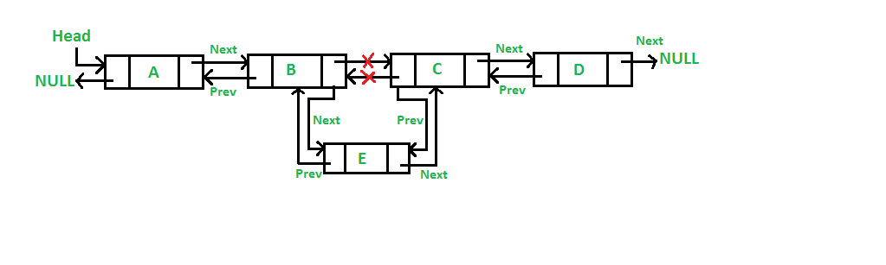

## II. Linked List
### Introduction
Linked lists are very similiar to lists and arrays, with the exception that they are linked. Hence they are called linked lists.

### Structure
I've always looked at linked lists like trains. Each train car has a connecting piece to the next and previous train cars. Like those train cars, each node has on one end a pointer pointing to the previous car called prev, and on the other side another pointer pointing to the next car called next. It keeps the entire list ordered and connected to each other.
One of the other distinguishing features of this structure (similiar to a train) is that there is a head and a tail to each linked list. The head shows where it starts and the tail shows the end.


### Inserting
When it comes down to it, a linked list is still essentially a list. To insert, we will still need to loop through the list, unless we insert at the head or tail. Because a linked list is structured, the head and tail are predefined positions that we maintain. This would make inserting at those specified places instaneous. Otherwise we loop through until we find the node we want to modify or the place where we want to insert a new node.

To insert in the list, there are certain steps to accomplish. 
First, we must create a new node called "E".
```python
E = LinkedList.Node(value)
```
Because we have selected node B and inserting E, we need to make all the edits using only nodes B and E.
Second, we need to start attaching it to the nodes B and C by setting the "prev" of node E to the current node (B). 
```python
E.prev = B
```
Third, set the "next" of node E to the next node after B, which is C.
```python
E.next = B.next
```
Fourth, set the "prev" of the "next" node (C) after the current node to the node E.
```python
B.next.prev = E
```
Lastly, set the "next" of the current node (B) to the node E.
```python
B.next = E
```
Node E has been sucessfully inserted between B and C.



Inserting at the head or tail is pretty straightforward and is not as difficult as inserting in the middle of the list.

Inserting at the head:
Create a new node called "E".
```python
E = LinkedList.Node(value)
```
Set the "next" of E to the current head (A)
```python
E.next = self.head
```
Set the "prev" of the current head(A) to E 
```python
self.head.prev = E
```
Set the head equal to E
```python
self.head = E
```

Inserting at the tail is a very similar process. Just remember which nodes the "prev" and "next" point to.

### Removing


### Accessing Values
Accessing values in linked lists are very simple. We can get the value (data) with this code to change the value.
```python
yield curr.data
``` 
We can also reassign the value with this code.
```python 
curr.data = value
```

### Big O Notation
As you notice in the table below, our Big O Notation for most of these operations is O(1). This makes using Linked Lists very benefical for our coding.
Operation       | Efficency
----------------|-----------
Looping         | O(n)
Remove middle   | O(n)
Remove head     | O(1)
Remove tail     | O(1)
Insert middle   | O(n)
Insert head     | O(1)
Insert tail     | O(1)
Size            | O(1)
Empty           | O(1)

### Example -- Remove Duplicates
Here we have an example of removing duplicates from a linked list.

```python


```

### Problem to Solve -- Enter In A Book Series In Order 
We have a challenge for you. For this problem, you will be tasked with reordering this linked list of books so that the books are in order for the series.

Here is your [starting code](2-books.py)

Once finished, compare your answer to this [solution](2-books_solution.py).
Remember, there's more then one way to solve a problem in programming. 


### Next Data Structure
You've finished this part of the tutorial! We do have one more data structure to teach.
Please head on back to the [welcome page](0-welcome.md) to start the last one.