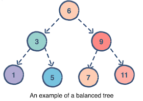

## III. Tree

#### Introduction
Trees are a great way to hold data that we can potentially access faster then we would with an array. There a lot of different types of trees, but today we'll keep it pretty general.

#### Structure
Like all trees, it starts with a root. Think of it as an upside down tree with the root on top. From there, the root can extend into two directions, left and right. These are nodes. Each node can only have two other nodes attached to it, one going left, and one going right. Balanced Trees are great because those are easier to navigate and find values. We put the values that are larger then the parent node to the right, and those that are smaller go to the left.This is the basic structure of a tree.



#### Recursion
Before we begin learning about how to navigate and manipulate trees, we need to learn about recursion.

Recursion is calling the function within the same function until a condition is met. This is a way to simply solve complex problems if done right.

```python
def number(num):
    if num <= 1:
        print(num)
    else:
        print(num)
        number(num-1) #Recall the same function

number(8)
```

#### Inserting
To insert, we first need to find where we want to insert. We do this by recursion as discussed above. We first have a base case which is if there's an empty spot on the tree to insert at. Otherwise, we recall the same function to check the next node.


#### Removing
Removing a node can take off a whole branch, in this case we need to be careful on how to reattach said branch

#### Traversing


#### Big O Notation

Operation       | Efficency
----------------|-----------
Looping         | O(n)
*Remove         | O(n) or O(1)
Insert          | O(n)


#### Example -- Count The Nodes
Here is an example code showing how to count the nodes in a tree.

```python

```

#### Problem to Solve -- Delete Smallest Value
Ready for the final challenge? Our task here is to find the smallest value in a tree. Fix the code to get it to find the smallest value.

Here is your [starting code](3-smvalue.py)

Once finished, compare your answer to this [solution](3-smvalue_solution.py).
Remember, there's more then one way to solve a problem in programming. 

#### And Here's the End
Congratulations, you've finished all the tutorials! Don't stop here though, do your own research and learn as much as you can about the many other data structures out there. 

[Home Page](0-welcome.md)

